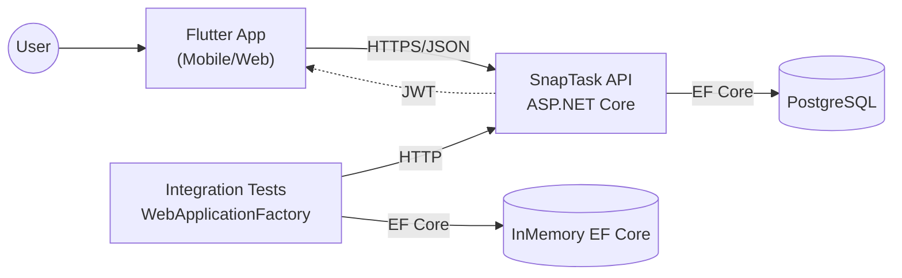

# Architecture

## Overview

SnapTask is a full‑stack task board application with a REST API, JWT authentication, and a Flutter client. The backend follows a Clean Architecture layout (Domain, Application, Infrastructure, WebApi).

## Container Diagram (C4‑style)

## Key Design Decisions

- **Clean Architecture** to keep use cases independent from infrastructure.
- **JWT + ASP.NET Identity** for authentication.
- **ProblemDetails** for consistent API error responses.
- **Integration tests** running with in‑memory EF Core and a testing environment.

