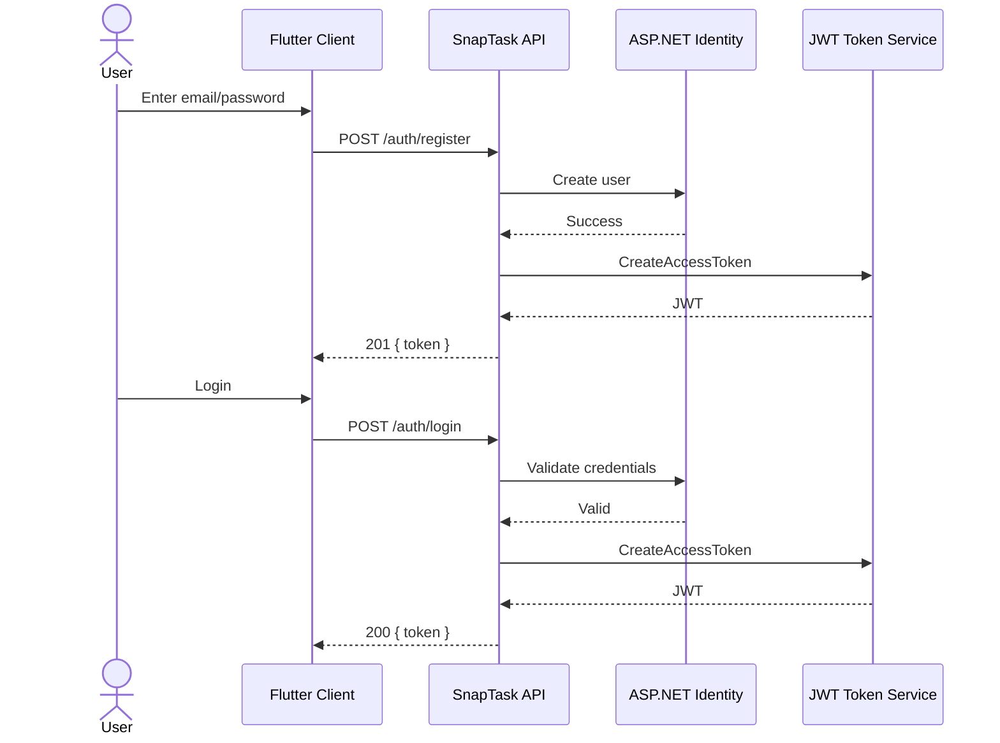
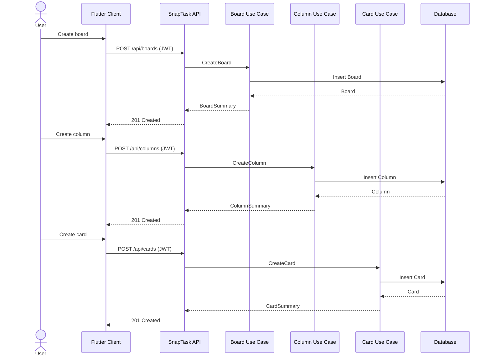
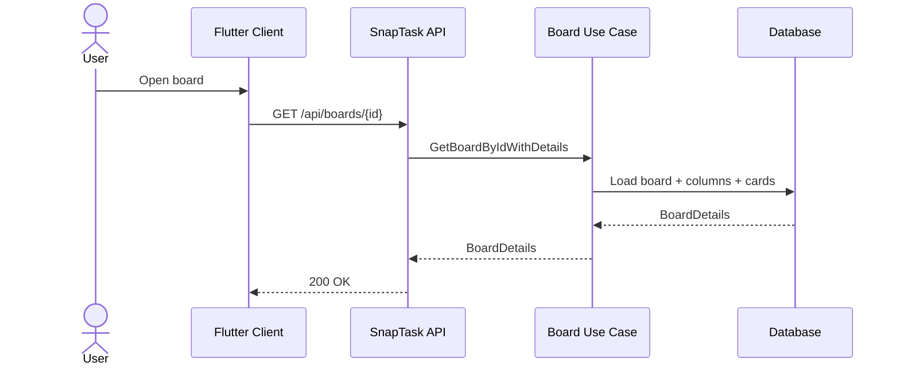

# User Flows

This document captures core flows as sequence diagrams.

## 1) Register + Login

```mermaid
sequenceDiagram
  actor U as User
  participant C as Flutter Client
  participant A as SnapTask API
  participant I as ASP.NET Identity
  participant J as JWT Token Service

  U->>C: Enter email/password
  C->>A: POST /auth/register
  A->>I: Create user
  I-->>A: Success
  A->>J: CreateAccessToken
  J-->>A: JWT
  A-->>C: 201 { token }

  U->>C: Login
  C->>A: POST /auth/login
  A->>I: Validate credentials
  I-->>A: Valid
  A->>J: CreateAccessToken
  J-->>A: JWT
  A-->>C: 200 { token }
```

## 2) Create Board → Create Column → Create Card

```mermaid
sequenceDiagram
  actor U as User
  participant C as Flutter Client
  participant A as SnapTask API
  participant B as Board Use Case
  participant L as Column Use Case
  participant K as Card Use Case
  participant DB as Database

  U->>C: Create board
  C->>A: POST /api/boards (JWT)
  A->>B: CreateBoard
  B->>DB: Insert Board
  DB-->>B: Board
  B-->>A: BoardSummary
  A-->>C: 201 Created

  U->>C: Create column
  C->>A: POST /api/columns (JWT)
  A->>L: CreateColumn
  L->>DB: Insert Column
  DB-->>L: Column
  L-->>A: ColumnSummary
  A-->>C: 201 Created

  U->>C: Create card
  C->>A: POST /api/cards (JWT)
  A->>K: CreateCard
  K->>DB: Insert Card
  DB-->>K: Card
  K-->>A: CardSummary
  A-->>C: 201 Created
```

## 3) Fetch Board Details

```mermaid
sequenceDiagram
  actor U as User
  participant C as Flutter Client
  participant A as SnapTask API
  participant B as Board Use Case
  participant DB as Database

  U->>C: Open board
  C->>A: GET /api/boards/{id}
  A->>B: GetBoardByIdWithDetails
  B->>DB: Load board + columns + cards
  DB-->>B: BoardDetails
  B-->>A: BoardDetails
  A-->>C: 200 OK
```
